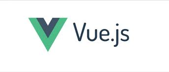

# 前端工程化

## 前端发展大事件

- 1994 年，Netscape（网景）公司成立并发布 Netscape Navigator 浏览器。
- 1995 年 5 月，网景公司的布兰登·艾克花了十天时间设计出了 JavaScript 原型。
- 1996 年 11 月，网景公司正式向 ECMA（欧洲计算机制造商协会）提交语言标准，1997 年 6 月，ECMA 以 JavaScript 语言为基础制定了 ECMAScript 标准规范 ECMA-262。
- 2005 年 2 月，杰西·詹姆士·贾瑞特发表博文《Ajax: A New Approach to Web Applications》，浏览器异步请求的术语 ajax 被广泛使用。2006 年 4 月，W3C 组织发布第一版关于`XMLHttpRequest`对象的草案，尝试对其设定 Web 官方标准。
- 2006 年 8 月，jQuery 发布。
- 2008 年 9 月，Google 发布 Chrome 浏览器。同时发布了 Chrome 的开源版本 Chromium，其中包括了 JavaScript 的解释引擎 V8。
- 2009 年 11 月，瑞安·达尔在欧洲 JSConf 大会上展示了其编写的 Node.js 项目。Node.js 使用了 V8 作为其 JavaScript 解释器。
- 2010 年 1 月，npm JavaScript 包管理系统诞生。
- 2012 年 3 月，webpack 发布。
- 2012 年 9 月，babel 发布。
- 2012 年 10 月，typescript 发布。
- 2013 年， eslint 发布。
- 2013 年 5 月，react 发布。
- 2014 年 2 月，vue 发布。
- 2015 年 6 月，ECMAScript2015 发布，此后 ECMAScript 每一年升级一个版本。
  .......

从互联网开发的历史来看，前端开发算是一个“年轻”的职业，早在十年之前，并没有对“前端开发”、“前端工程师”设立一个专门的类目，也没有与“后端开发”区分，一般统称为“互联网开发”，而一名“互联网开发工程师”既要写后端代码，也要写前端代码。

一方面，随着互联网行业进入快速发展阶段，互联网产品的功能越来越强大，对互联网产品的用户体验的要求越来越高，页面上的功能和交互也越来越丰富，导致单个页面上承载的前端代码也越来越多，而前端代码的一些自身缺陷（弱类型、无模块等）以及和后端代码的强耦合所导致的可读性差、可维护性差等问题也随着代码量的增加而逐渐显现。另一方面，前端技术在近十年也进入了高速发展的阶段，尤其是 V8 的诞生，使得 JavaScript 的运行速度大大提升，Node 的诞生，使得 JavaScript 有能力脱离浏览器环境，在服务器环境运行。上述情况让前端工程化变得必要且可行。

## 前端工程化概念

由于前端代码的天然的松散性，在前端工程化的概念出现之前，前端开发工作可以用刀耕火种来形容。

1. 没有专门的 IDE，要么使用一些简陋的文本编辑器（notepad++等），要么使用后端的 IDE（eclipse 等）进行开发，没法提供严谨的代码提示。
2. 由于 HTML、CSS、JavaScript 均为解释型语言，没有编译过程，并且语法结构均非常松散，一些代码错误在编写过程中难以察觉，只能放到浏览器运行环境中去测试、调试。
3. JavaScript 早期以简单为设计原则，没有设计模块化语法，在页面 JavaScript 代码量激增的情况下，会出现命名空间冲突问题，也导致代码难以维护。
4. 引用第三方库（例如 jQuery）时，通常使用下载再复制到项目中的方法，导致项目中的第三方库难以维护，没法跟踪第三方库的更新、修复情况。

前端工程化就是为了解决上述诸多问题而存在，以工程化的思路去管理和维护项目前端代码，从而提升前端代码可维护性、保证项目开发质量、提高协作开发效率。

大体上，前端工程化可以从为模块化、组件化、规范化、自动化四个方面来考量。

### 模块化

模块化是将项目中的资源以合理的方式进行拆解与封装，再用明确的依赖关系进行组织的过程。

#### JavaScript 模块化

JavaScript 早期没有提供模块语法，这对开发大型的前端工程造成了非常大的障碍。为解决该问题，前端社区自行设计开发了各种模块化方案，比较有名的有：AMD、CMD、CommonJS 等，其中 node 使用的就是 CommonJS 的模块化方案。在 2015 年，随着 ECMAScript2015 的发布，终于在语言层面补充上了缺失已久的模块语法（简称 ESM）。ES2015 的模块语法非常简介好用，完全可以替代上述社区设计的模块化方案，并且这是大势所趋。

```javascript
// a.js
const foo = "hello";

export { foo };
```

```javascript
// b.js
import { foo } from "./a.js";

console.log(`${foo} world`);
```

虽然已经在语言层面设计了模块语法，但存在的一个问题是代码的运行环境缺乏对 ESM 语法的支持，也就是浏览器兼容性问题。JavaScript 代码需要在不同厂商、不同版本的浏览器中运行，而很多老版的浏览器（例如 IE9）未提供对这些模块语法的支持。所以实际的使用情况是，开发人员在项目中使用 ESM 模块语法编写项目的源代码，然后使用一种开发工具——模块打包器（bundler）对源代码进行“编译”，将各个模块进行封装并整理模块之间的依赖关系，最后生成去除了 ESM 语法、浏览器可以正常解释运行的 JavaScript 代码，从而解决该问题。常用的模块打包器有 webpack、rollup、parcel 等等。


#### CSS 模块化

原生的 CSS 提供了`@import`语法，用于 CSS 文件间的导入，但由于存在性能问题，且功能较弱，基本没有使用场景。当前 CSS 文件的模块组织主要靠 CSS 的预编译语言来实现，常见的 CSS 预编译语言主要有 Sass、less、stylus 等，值得一提的是，这些预编译语言不仅提供了模块语法，还为 CSS 丰富了大量其它实用的语法，如变量声明、循环、判断、混入等等，大大提升了 CSS 的灵活性。


```scss
// a.scss
$bg-color: red;
```

```scss
// b.scss
@import "./a.scss";

.wrap {
  background-color: $bg-color;
}
```

#### 第三方依赖模块化

前端项目模块化的另一个的问题是对引入的第三方依赖的管理与维护，第三方依赖从某种角度上说也是要导入到项目中的一个个“模块”。曾经的复制粘贴到项目中的方式明显是不可取的，JavaScript 需要一个类似于其他语言拥有的管理第三方依赖的工具，类似于 Maven 之于 Java、Gem 之于 Ruby，因此，npm 应运而生。npm 能让开发者将自己封装的依赖上传到 npm 的托管平台，并带上依赖的关键信息，包括版本号、作者等等，以方便维护；其他开发者可以从 npm 的平台上下载这些依赖到自己的项目中，并且带上了所下载依赖的关键信息，以辅助开发者维护项目中使用到的第三方依赖。


```bash
# 在项目中安装jquery依赖
npm i jquery -S
```

```javascript
// 在项目中使用jquery
import $ from "jquery";

$("#app").text("hello world");
```

webpack 和 npm 不止这些功能，更多细节将会在下文详述。

### 组件化

值得一提的是，有人经常认为模块化和组件化是同一概念，其实并非如此。模块化是对前端项目中使用到的代码乃至资源的一种组织，主要从项目结构的角度进行考量；而组件化是对页面上的一个个“逻辑单元”的一种封装设计，主要从页面结构的角度进行考量。


一个由模板（HTML）、样式（CSS）、逻辑（JavaScript）组合而成的功能完备的结构单元，称之为组件。一个组件应当有如下特点：

1. 高内聚性。一个组件的内部内容（HTML、CSS、JavaScript）应当关系紧密，尽量避免出现无关内容。
2. 低耦合性。一个组件应当与其他组件的耦合程度低，应当尽量减少不必要的关联。
3. 一个组件应当暴露适当的接口，用于其他组件进行通信。
4. 组件可以拼接、嵌套。就像拼图一样，小的组件可以拼接成大的组件，大的组价可以拼接成整个页面。

随着前端应用日益复杂，组件化开发思想的优势逐渐显现，并被大多数前端开发所认可，成为当前主流的开发思想。当前最红的三大前端开发框架：react、angular以及vue，也均是以组件化开发为其开发思想。




### 规范化

前端代码的松散性，降低了前端技术学习的入门门槛。但随着项目的结构越来越复杂，代码体积越来越庞大，同时项目开发成员约来越多，代码风格各不相同，带来了越来越多的不可维护的问题。代码规范化就是对项目代码的编写进行一定程度的约束，增强其可读性、可维护性和稳定性，代码规范化最理想程度是“让所有项目成员写出风格一致的代码”。

#### 语言

首先，ECMAScript 在 ES2015 版本进行了一次历史性的升级，修复了许多之前版本的 ES 存在的问题，更重要的是，自 ES2015 版本之后，ECMAScript 每隔一年进行一次版本升级，以保持该语言的先进与活力，所以，我们在选则 JavaScript 语言版本时，应当尽量选择新版的语法进行开发（至少是 ES2015 之后的版本）。然而，这同样会出现浏览器兼容性问题，为解决这个问题，babel 应运而生。babel 一个 ECMAScript 语言的“转译器”，用于将我们编写的前端源码转译为满足浏览器兼容性的前端代码。


但是，可以预见的是，无论 ECMAScript 未来如何发展，都很难改变 ES 弱类型这一特性。但是弱类型又会导致一系列不稳定的问题，TypeScript 就是解决这些问题而存在的。TypeScript 最主要的特性之一就是为 ECMAScript 赋予类型声明，弱类型变强类型，代码的稳定性进一步增强。


#### 代码 Lint

代码 Lint 的好处有很多：

1. 保证项目成员编写的代码风格一致，提升可读性。
2. 避免一些低级错误，比如使用未经声明的变量。
3. 统一代码最佳实践，比如一般认为 for of 比 for 要好，可以保证项目中的循环统一使用 for of。
4. 代码格式统一。

当前主流的前端代码 Lint 工具主要有二，一个是规范 JavaScript 的 eslint，一个规范 CSS 的 stylelint。


#### 代码格式

原本代码格式也应该归属于代码 Lint 的范围，但是 facebook 公司在 2017 年推出了一款可以大大提升开发体验的代码格式化工具：Prettier。


关于代码格式，常常有两个痛点令开发头痛不已，一是对代码格式无休止的争论：有人认为 tab 缩进好，有人认为 space 缩进好；有人认为结尾要加分号，有人认为结尾不要分号。二是代码格式的执行，开发常常需要手动去修改缩进、空格等方面的问题，会花费不少时间并且打断开发思路。

Prettier 有效解决了上述两个问题，它有自己的原则，终止了代码格式方面的争论，并且能即时触发格式化。更强大的是它语言全覆盖，JavaScript、CSS、HTML 甚至 markdown 都能格式化，能让开发者从这种琐碎的工作中解脱。

#### 代码测试

前端的代码测试包含单元测试、端到端测试

### 自动化

上文介绍的前端开发工具，babel、eslint、prettier 等等，都提供了诸如终端命令、API 等诸多方式供开发使用。除了上述工具需要在前端工程化中使用外，还有一些未提到的工作在前端工程化中也必不可少，例如与后端的联调、对要发布的代码压缩混淆等，下面展示了从项目源码到浏览器上运行的目标代码要经历的处理流程（有所简化）：

源码 -> prettier 格式化 -> eslint、stylelint 检查 -> babel/typescript 编译、sass/less 编译 -> webpack 打包 -> 压缩混淆 -> 计算哈希 -> 保存文件 -> 目标代码

可以看到，如果我们用敲打一个个命令行的办法去执行每个步骤，将会成为非常麻烦非常头痛的一件工作，会消耗大量的时间和人力成本，并且没有办法将这些流程融入到日常的开发当中，开发没法在开发过程中看到自己编写的代码存在的问题以及运行的效果。我们需要一些工具把这些处理流程串联起来，能自动化的运行，并且能有效融入开发过程中，真正意义上的提升开发体验。

#### 构建工具

前端的构建工具是将这些零散的开发工具串联起来的核心利器，前端常见的构建工具有 grunt、gulp、webpack、parcel 等等。我们在前文已经介绍过了 webpack 的打包（bundler）功能，但它的功能不仅这些，实际上 webpack 是当前主流的前端应用构建工具。webpack 通过它的加载器（loader）和插件（plugin）机制将各种前端开发工具接入到它的构建流程中，让这些工具在构建过程中发挥作用。

并且，webpack 以“一切皆模块”作为其设计理念，不仅 JavaScript 是模块，CSS 代码、HTML 代码，乃至图片、字体、svg 等等一切前端项目需要用到的静态资源在 webpack 的管辖下均为模块，均可以以合适的语法导入到项目中。这么做有如下好处：

1. 项目依赖清晰明了。一个前端项目引用了什么资源，各个资源之间的依赖关系是怎么样的，利用 webpack 可以帮助开发者“描绘”出一个非常清晰的依赖关系图，非常有利于项目维护。
2. 资源处理统一集成。可以为前端项目中需要使用的各种资源编写 loader 来使资源加入到 webpack 的构建流程中，归入 webpack 管辖，当然，开发社区已经提供了大量易用的 loader。
3. 依赖关系处理简洁。所有静态资源之间的依赖关系统一由 webpack 管理，webpack 自动进行资源路径的分析与处理，不需手动处理生成目标代码时的图片、字体等资源的路径问题。


webpack 提供的功能远不止此。作为当前绝大多数前端应用的构建工具，webpack 本身提供了非常丰富的基础开发服务，并且可以通过插件 plugin 机制对其做进一步的拓展和丰富，常用到的功能有：

1. 搭建本地开发环境。在前端开发本地搭建 node 服务器 dev server，提供基础的静态资源请求服务。
2. 开发环境请求代理 http proxy。对于需要后端处理的 http 请求，可用通过设置请求代理转发给后端。
3. 源码还原 source map。由于在浏览器中的运行的是经过多个工具编译的目标代码，源码已被改动的面目全非，不利用调试，webpack 可以生成 source map 将目标代码解译为源码，以方便开发调试。
4. 优化静态资源缓存策略。对于生成的要部署到生产环境的代码，webpack 会根据文件内容生成哈希值，用于给资源文件命名，从而优化浏览器缓存策略。
   ......

#### 代码编辑器

我们希望 JavaScript、TypeScript、eslint 等语言及 Lint 工具分析出来的的错误能够在编写代码的过程中就能提示出来，这样就能在编写时马上修复，提升修复速度并避免问题扩散。最好就是能在代码编辑区展示出来，例如红色的波浪线。


上文描述过早期的前端开发没有一件趁手的代码编辑工具，这一情况在前端技术高速发展的近几年有显著的改善。轻量快速的有 Visual Studio Code（VSCode）、atom 等，功能全面的有 WebStorm。


使用 VSCode 配合上合适的 VSCode 插件，并做好合理的设置，可以有效的实现我们期望的代码错误提示效果。常用到的 VSCode 插件有：

1. EditorConfig for VS Code。EditorConfig 插件，读取.editorconfig 文件，提供最基础的代码编辑配置，控制代码缩进、行尾符等等。
2. ESLint。eslint 插件，读取.eslintrc.js 配置，提供 javascript/typescript 代码 lint 的实时提示等功能。
3. stylelint。stylelint 插件，读取.stylelintrc.js 配置，提供 css/scss 代码 lint 的实时提示等功能。
4. Prettier - Code formatter。Prettier 插件，读取.prettierrc.js 配置，对代码格式进行自动格式化。
5. Code Spell Checker。检测英文单词拼写有没有问题（驼峰中划线下划线都能检测）。

对 VSCode 做如下设置：

```json
"eslint.validate": [         // 设置 eslint 插件检测 JavaScript、TypeScript 代码
    "javascript",
    "typescript"
],
"editor.formatOnSave": true, // 设置文件保存时格式化代码
```

在项目中安装好 eslint、styelint、prettier 等开发工具后，可以看到，VSCode 不仅能在编写时用各种颜色的波浪线提示出不同程度的问题，而且能在保存时修复代码格式化方面的错误：


#### git 钩子

开发人员在编写代码时难免会编写错误的代码，但是考虑如下场景：一个前端项目由多名前端开发人员协作开发，如果某一个开发写的错误代码合并到了主干分支并推送到了远端，其他开发人员拉取了这些错误代码，那么就会导致这些错误扩散到其他人的工作环境上，影响到其他人的开发工作，甚至导致编译失败的问题。因此，我们需要避免有问题代码提交并合并到主干分支。

我们可以利用 git 提供的钩子（hook），在某些关键的 git 行为触发之前执行代码检查的命令行，如果检测出错误，则终止该 git 行为的触发，从而有效避免问题的扩散。可以利用前端工具 Husky 以及 lint-staged 来帮助我们实现上述效果，Husky 是对 git 钩子的封装，方便在前端项目中使用，lint-staged 是对代码检查执行的优化，只对需要提交的代码进行代码检查操作。例如如下 package.json 片段：

```json
"husky": {
    "hooks": {
      "pre-commit": "tsc -p tsconfig.json --noEmit && lint-staged"
    }
},
"lint-staged": {
    "*.{js,ts}": [
        "npm run lint:es",
        "git add"
    ],
    "*.{scss,css}": [
        "npm run lint:style",
        "git add"
    ]
}
```

上面的这段代码，使用了 git 的 pre-commit 钩子，也就是在提交代码之前运行`tsc -p tsconfig.json --noEmit && lint-staged`指令。
